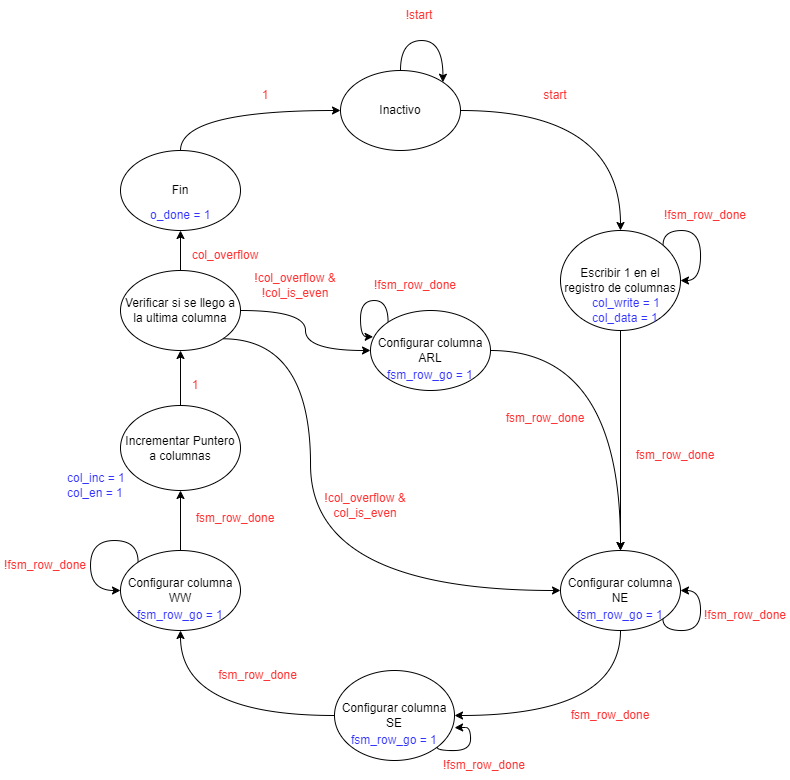
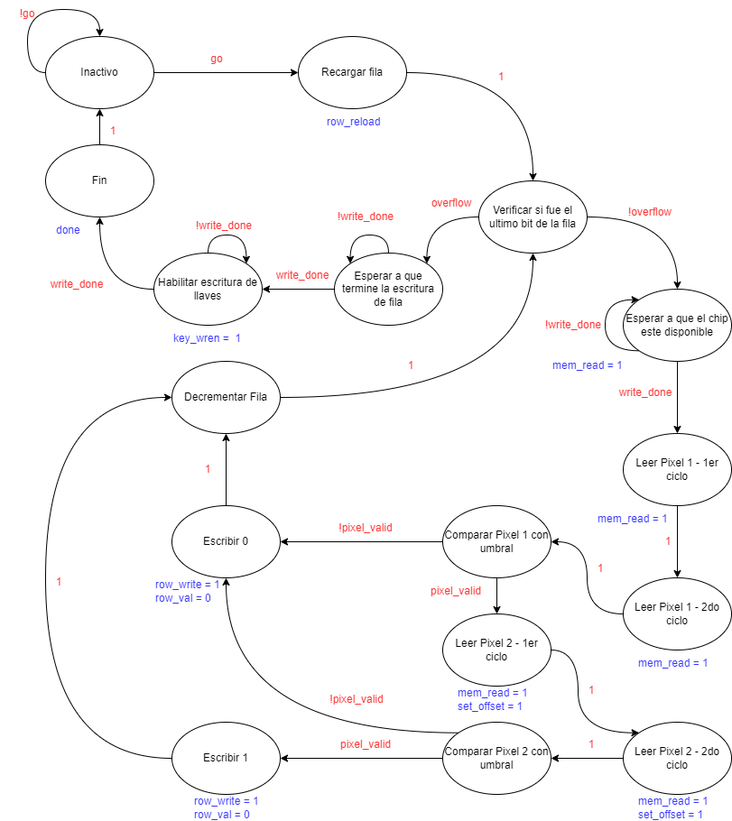

# CFG_FSM

Desde esta maquina de estados, se controla que columna y que tipo de llave se va a configurar. La primer columna corresponde a un pixel no conectado a la linea de amplificadores (ARL), por lo que se omite esta llave y se empieza ejecutando la maquina de estados "row_cfg_fsm" a partir de la llave NE y se repite para la llave SE y WW. Luego se pasa a la siguiente columna que tiene las llaves ARL - NE - SE - WW, en ese orden, y se repite hasta que se termina de escribir la ultima columna de llaves.

Segun la llave que se haya seleccionado, va a modificar el valor del offset que se asignará a la maquina de estados "row_cfg_fsm".

# ROW_CFG_FSM

Esta maquina de estado realiza el recorrido por el valor de cada columna de la ram para identificar que llaves deberian estar activadas.

Desde la maquina de estados superior "CFG_FSM" se ejecuta esta fsm 3 o 4 veces, dependiendo de la cantidad de llaves que posea el pixel.

En primer lugar, si el valor del pixel al que apunta la ram, no supera el umbral, escribe un 0 al chip. Si el valor almacenado en la RAM supera el umbral, se carga el valor del pixel al que se va a conectar con la llave a activar, si este pixel tambien supera ese umbral finalmente se escribe un 1 en el registro de filas. Este proceso se repite para todos los pixeles de la columna, recorrida de manera descendente, empezando por el último.

