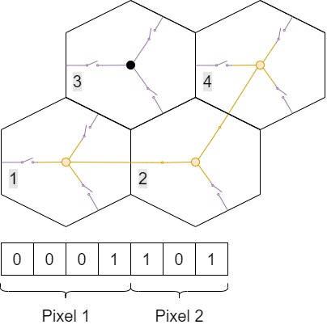
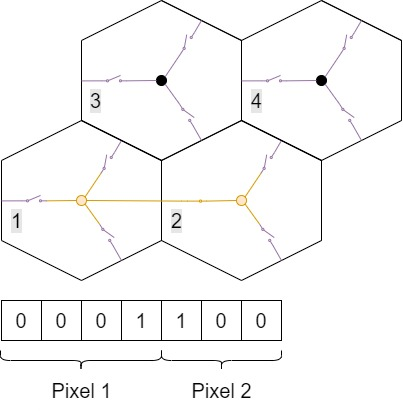
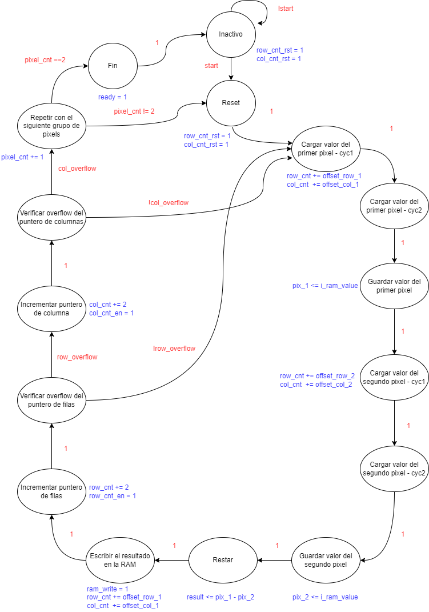

# Process FSM

Maquina de estados que se ejecuta posteriormente al escaneo, es la encarga de realizar la desacumulación de los pixeles.

Cada valor almacenado en la memoria RAM, corresponderá a la suma de los valores de los pixel que se deseaba medir y los que tuvieron que conectarse para poder acceder a ese pixel (Excepto un pixel que esta conectado a la ARL, cuya conexión es directa). Por ejemplo, para el caso del pixel 4, se debe restar el valor almacenado al leer el pixel 2:

Pixel 4:

 	

Pixel 2:



Para obtener el valor de cada pixel a partir de las lecturas se realizan las siguientes restas de pixeles:

```
      . X         . .         X .
    X X         X X         X .
    -           -           -
      . .         . .         . .
    X X         X .         X .
    _____       _____       _____
      . X         . .         X .
    . .         . X         . .
```


    El pixel inferior izquierda corresponde un pixel conectado

    a la ARL, por lo que su valor leido ya es el del pixel

    individual.

    El resto de pixeles es un valor acumulado necesario para

    que acceda a una ARL.

    La FSM encargada de desacumular estos pixeles indexará la

    ram cada 2 pixeles y cargara los valores necesarios apli-

    cando un offset para seleccionar el valor de cada grupo.

    El offset se hace en referencia al pixel inferior derecho.

    Por ejemplo, para acceder al pixel de la ARL, se hace que

    el valor de la direccion de la RAM sea: [col+1, row],

    es decir, un offset de [1, 0].

    Para cada pixel las operaciones seran:

    RAM[c, r+1]   = RAM[c, r+1]   - RAM[c, r]

    RAM[c, r]     = RAM[c, r]     - RAM[c+1, r]

    RAM[c+1, r+1] = RAM[c+1, r+1] - RAM[c+1, r]

    Para que la FSM no tenga que repetir estados para cada

    offset, estos se guardaran en una rom, y se incrementara

    cada vez que haya que cambiar entre grupos de pixeles.


Diagrama de estados:


