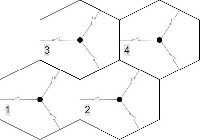
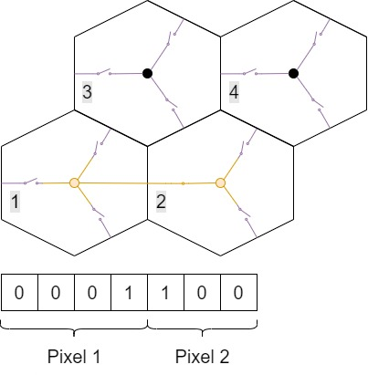
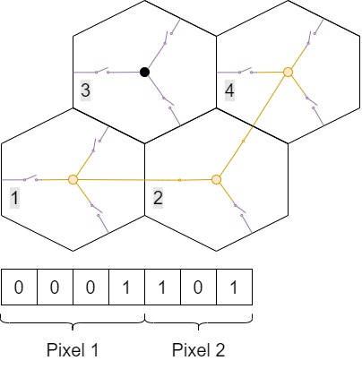
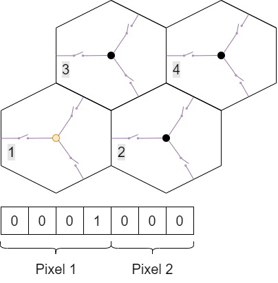
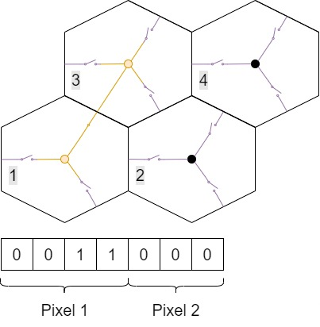

# SCAN_FSM.v

Es la maquina de estados que realiza el escaneo de la matriz de pixeles.
El algoritmo utilizado escanea la matriz completa en solo 4 barridos utilizando palabras de configuracion de 7 bits
para leer un conjunto de 4 pixeles (2 horizontales, 2 verticales).

La memoria se incremente de a dos columnas y dos filas, y con el offset dado por cada contador, se indexa el pixel leido.

Las palabras de configuracion resultantes son:

    1)
    Utilizando la palabra de configuracion 0001100
    Se leera la suma de pixeles 1 y 2:

    Se debe aplicar un offset de (0,0) al valor la
    direccion de memoria

    Utilizando la palabra de configuracion 0001101
    Se leera la suma de pixeles 1, 2 y 4:

    Se debe aplicar un offset de (0,1) al valor la
    direccion de memoria

    Utilizando la palabra de configuracion 0001000
    Se leer el pixel 1:

    Se debe aplicar un offset de (1,0) al valor la
    direccion de memoria

    Utilizando la palabra de configuracion 0011000
    Se leera la suma de pixeles 1 y 3:

    Se debe aplicar un offset de (1,1) al valor la
    direccion de memoria.

# CFG_WORD_SR

Es un registro de desplazamiento el cual se encargará de desplazar la palabra de configuracion de 7 bits al chip.

# SCAN_MODULE

Modulo para unir los dos modulos descriptos anteriormente
